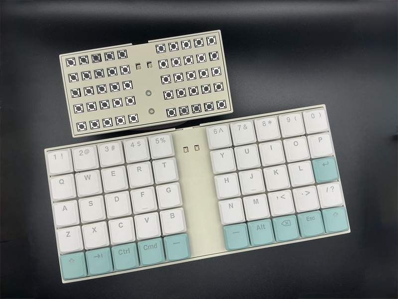
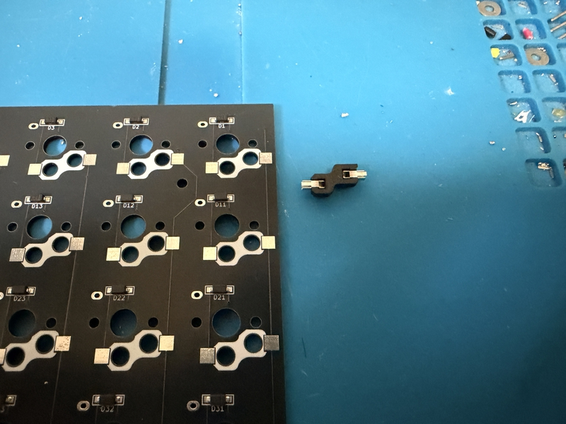
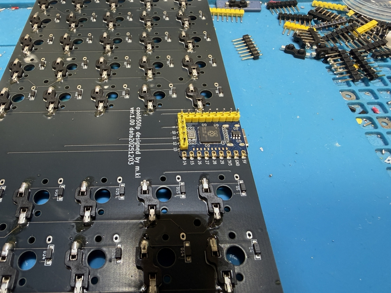
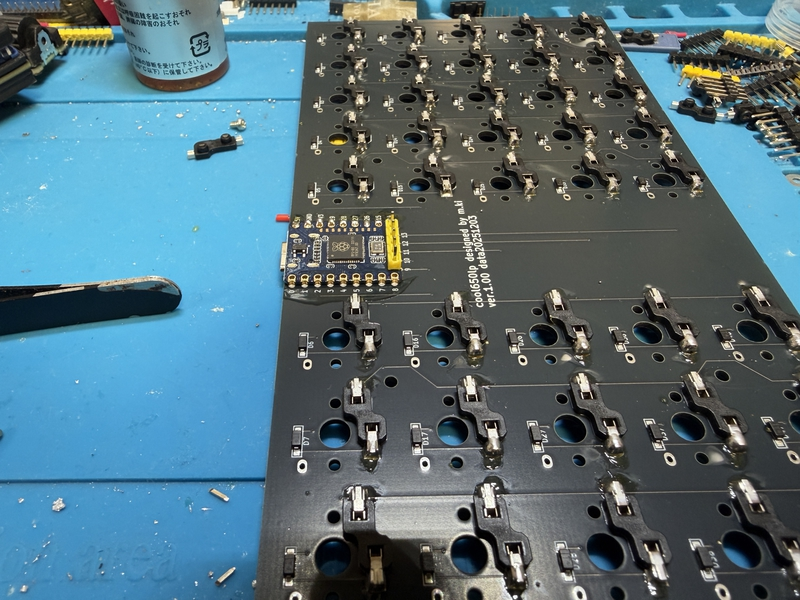
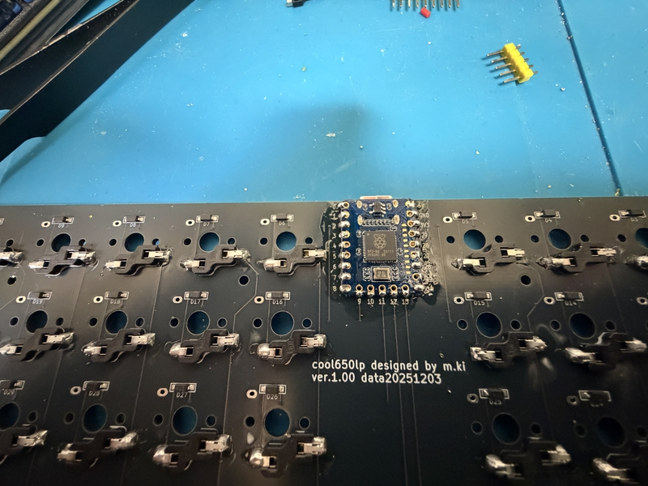

# cool650lp

## What is cool650lp?

cool650lp is 50% keyboard.
 
cool650lp use Low profile keyswitches and keycaps.
 
cool650lp use seeed RP2040-Zero,run qmk_firmware.
 
 

## firmware

cool650lp change keymap by [vial](https://vial.rocks/).

 

 

## buildguide

https://github.com/telzo2000/cool650lp/blob/main/buildguide_for_cool650lp.md

<b>Main steps</b>

1 Soldering switchsocket.

[Switch socketハンダ付け動画](https://youtu.be/ZnbgaueMR4w?si=_JLjD--3HJJ5Pu7Q)

 

2 Soldering RP2040-Zero.

[RP2040-Zeroのハンダ付け動画](https://youtu.be/FV4INvCWlU0)
 

3 Insert the switch socket into the top plate and then the PCB.

4 Insert the bottom case.

5 Insert the screw from above and secure it with the nut on the bottom case side.

6 Connect to your PC with a USB cable and install the firmware by dragging and dropping.

 

## BOM

<b>common parts</b>
| No. | Patrs | Quantity | remarks | Suppliers | Cost |
|--|--|--|--|--|--|
|番号|名前|数|備考|調達先|参考価格（送料込）| 
|1|PCB|3||[JLCPCB](https://jlcpcb.com)|| 
|2|Top plate|2|3D Print|||
|3|Bottom case|2|3D Print|||
|6|RP2040-Zero|1|MCU Board|[Talp keyboard](https://shop.talpkeyboard.com/products/rp2040-zero-usb-c-compatible)[Waveshare](https://www.waveshare.com/rp2040-zero.htm)|400円ぐらい|
|4|Diode ダイオード|50|SMD、PCBA済み|[遊舎工房](https://yushakobo.jp) [Talp Keyboard](https://talpkeyboard.net) [Daily Craft Keyboard](https://shop.dailycraft.jp)等|100個で220円程度から|
|5|Swith socket スイッチソケット|50|choc|[遊舎工房](https://yushakobo.jp) [Talp Keyboard](https://talpkeyboard.net) [Daily Craft Keyboard](https://shop.dailycraft.jp)等|10個で165円程度|
|7|Screw ネジ|8|スリムヘッドM2 6mm|[遊舎工房](https://shop.yushakobo.jp/products/a0800s2?variant=37665432535201)|50本880円(遊舎工房)|
|8|Nut ナット|8|M2ネジに付属していることが多い|DIY shop||
|9|Keycap キーキャップ|50|ロープロが最適|[遊舎工房](https://yushakobo.jp) [Talp Keyboard](https://talpkeyboard.net) [Daily Craft Keyboard](https://shop.dailycraft.jp)||

 

In addition, USB cable, etc. are required.
 
この他に、USBケーブル等が必要です。
 

 

# license

[CC BY-NC-SA](https://creativecommons.org/licenses/by-nc-sa/4.0/deed.ja)

