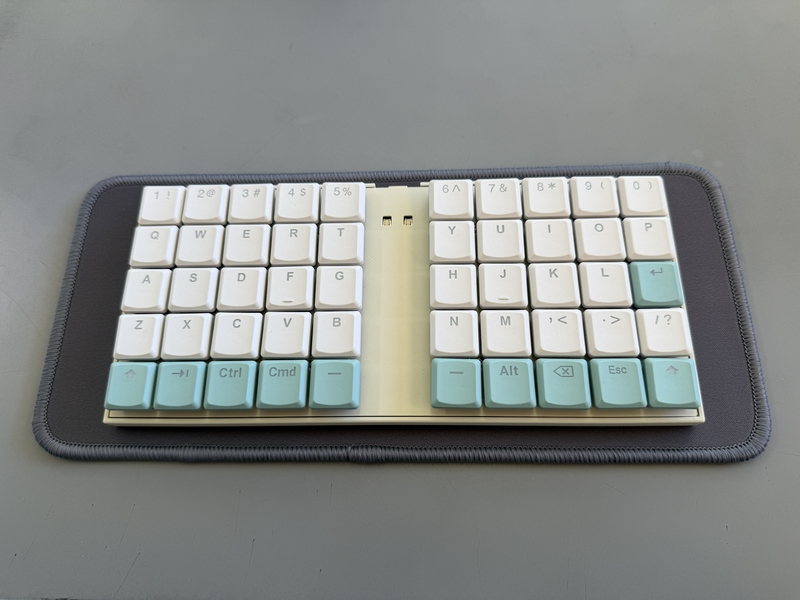
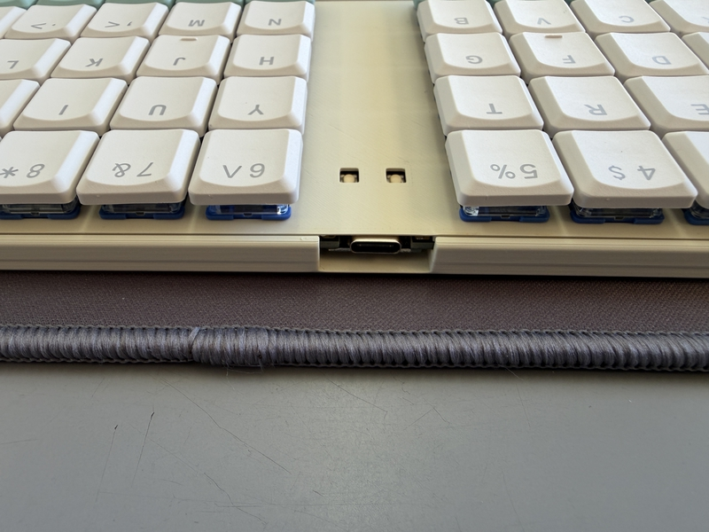
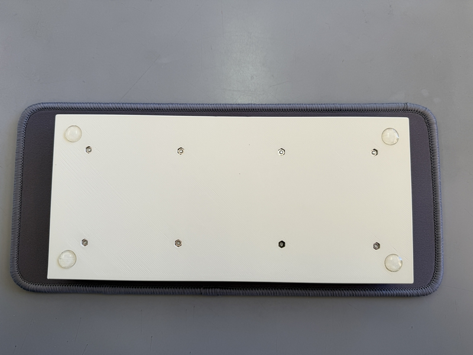
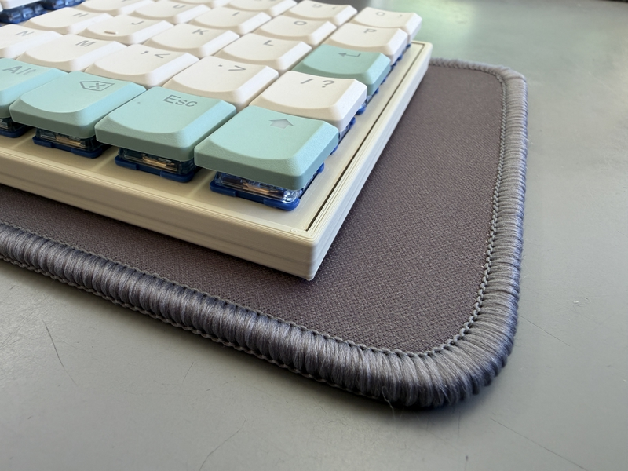

 　# Buildguide for cool650lp
 

## 0 部品の確認
 
Follow the BOM on github's readme.md to make sure that all the parts are available.
 
githubのreadme.mdのBOMに沿って、部品が全て揃っているかを確認してください。
 

## 1 ダイオードのはんだ付け

If the diode is already soldered, please skip this operation.
 
すでにダイオードのはんだ付けされている場合は、この作業を省略してください。
 
 
This work is done on the left and right keyboard boards respectively.
 
この作業は左右のキーボード基板でそれぞれ行います。
  
Solder the diodes to the back of PCB.
 
PCBの裏面にダイオードのハンダ付けをします。
 
As expected, it is compatible with SMD type.
 
ダイオードは、SMDタイプに対応しています。
 
Diodes have polarity, so be careful about the direction in which they are installed.
 
ダイオードには極性がありますので、取り付ける向きに注意してください。
 

[ダイオード（SMD)のはんだ付けの動画](https://youtu.be/ODk16bd4XkA)
 

 

## 2  スイッチソケットのハンダ付け

cool650lp supports choc switch sockets.
 
cool650lpでは、chocのスイッチソケットに対応しています。
  
Solder the switch socket to the back of the keyboard board.
 
キーボード基板の裏面にスイッチソケットのハンダ付けをします。
 

[Switch socketハンダ付け動画](https://youtu.be/ZnbgaueMR4w?si=_JLjD--3HJJ5Pu7Q)

 

## 3 RP2040-Zeroのハンダ付け

 
次の動画を参考にしてハンダ付けをしてください。
 

[RP2040-Zeroのはんだ付け動画](https://youtu.be/FV4INvCWlU0?si=ENKXU5vA0EeIhCRw)

## 4　キースイッチの装着

Insert the key switch in the following order: top case, then PCB.
 
トップケース、PCBの順になるように、キースイッチを差し込んでください。
 
When inserting the key switch, make sure the pins are straight.
 
キースイッチを差し込む時、キースイッチのピンが真っ直ぐになっているか、確認してください。
 

## 5 ボトムケースの装着

Attach the bottom case to the underside of the PCB, with the bumpy side of the bottom case facing the PCB.
 
PCBの下面にボトムケースを装着します。ボトムケースには凹凸がある面が、PCBに向くようにしてください。
 
 
Insert eight 6mm M2 screws into the top case. Secure the bottom case with M2 nuts.
 
トップケース側から、M2ネジ6mmを８箇所差し込みます。ボトムケース側では、M2ナットで固定してください。
 
 

##  6　キーキャップの装着

Please attach your favorite keycap.
 
お好きなキーキャップを装着してください。
 

## 7 動作確認について

Connect the keyboard to your PC with a USB cable, then press the reset button and boot button on the RP2040-Zero through the rectangular window in the top case.
 
PCとキーボードをUSBケーブルで繋ぎます。その後、トップケースにに開いた四角窓から、RP2040-Zeroのリセットボタン、ブートボタンを押します。
 
 

Press and hold the left button and then press the right button to mount a folder on your PC.
 
ボタンは、左を押したまま、右を押すと、PCにフォルダがマウントされます。
 
 

Just drag and drop the uf2 file from [here](https://github.com/telzo2000/cool650lp/tree/main/firmware) into the mounted folder.
 

[ここ](https://github.com/telzo2000/cool650lp/tree/main/firmware)にあるuf2ファイルを、マウントされたフォルダにドラッグ&ドロップすれば大丈夫です。
 
 

## 8 完成

After attaching non-slip rubber to the bottom of the bottom case, it's done.
 

ボトムケースの底面に、滑り止めゴムを取り付けたら、完成です。
 

Please enjoy a life with a better keyboard.
 
よりよいキーボードのある生活を楽しんでください。
 

